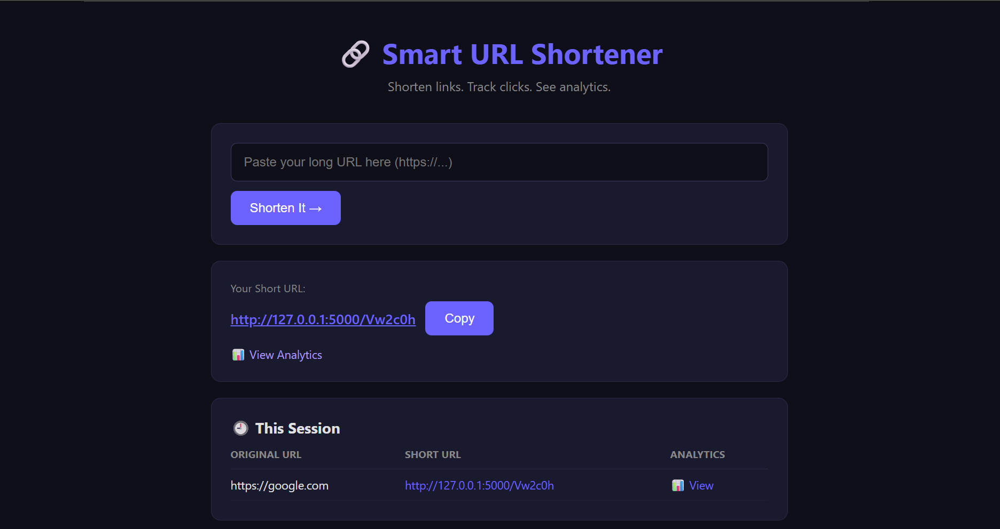
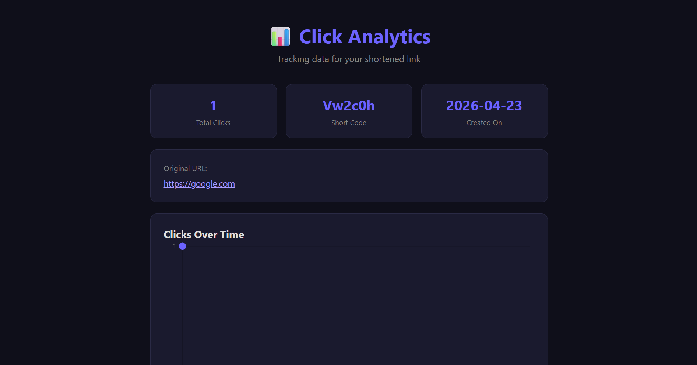

# 🔗 Smart URL Shortener

A full-stack URL shortening web app built with Python Flask, SQLite,
and vanilla JavaScript — featuring click tracking and a live analytics
dashboard.

---

## ✨ Features

- 🔗 Shorten any valid URL instantly
- 📋 One-click copy to clipboard
- 📊 Per-link analytics dashboard with Chart.js graph
- 🗃️ Persistent storage with SQLite
- 📈 Daily click tracking with timestamped logs
- 🕘 Session history table on homepage

---

## 🛠️ Tech Stack

| Layer     | Technology              |
|-----------|-------------------------|
| Backend   | Python 3, Flask         |
| Database  | SQLite3                 |
| Frontend  | HTML5, CSS3, JavaScript |
| Charts    | Chart.js                |

---

## 📁 Project Structure

\`\`\`
smart-url-shortener/
├── app.py              # Flask routes & core logic
├── database.py         # DB connection & initialization
├── schema.sql          # SQL table definitions
├── static/
│   ├── style.css       # Dark theme UI styles
│   └── script.js       # Async frontend logic
├── templates/
│   ├── index.html      # Home page
│   └── analytics.html  # Analytics dashboard
└── urls.db             # Auto-generated SQLite database
\`\`\`

---

## ⚙️ Local Setup

\`\`\`bash
# 1. Clone the repo
git clone https://github.com/jasmeetkaur06/smart-url-shortener.git
cd smart-url-shortener

# 2. Install dependencies
pip install flask

# 3. Run the app
python app.py

# 4. Open in browser
http://127.0.0.1:5000
\`\`\`

---

## 📊 Database Schema

\`\`\`sql
-- Stores each shortened URL
CREATE TABLE urls (
    id          INTEGER PRIMARY KEY AUTOINCREMENT,
    original    TEXT    NOT NULL,
    short_code  TEXT    NOT NULL UNIQUE,
    created_at  DATETIME DEFAULT CURRENT_TIMESTAMP,
    click_count INTEGER DEFAULT 0
);

-- Logs every individual click (for analytics graph)
CREATE TABLE clicks (
    id         INTEGER PRIMARY KEY AUTOINCREMENT,
    short_code TEXT    NOT NULL,
    clicked_at DATETIME DEFAULT CURRENT_TIMESTAMP
);
\`\`\`

---

## 🚀 API Reference

| Method | Endpoint                    | Description                  |
|--------|-----------------------------|------------------------------|
| GET    | `/`                         | Home page                    |
| POST   | `/shorten`                  | Shorten a URL                |
| GET    | `/<short_code>`             | Redirect to original URL     |
| GET    | `/analytics/<short_code>`   | Analytics page               |
| GET    | `/api/analytics/<short_code>` | JSON data for chart        |

---

## 📸 Screenshots

### 🏠 Home Page

### 📊 Analytics Page

---
## 🌐 Live Demo
👉 https://smart-url-shortener-p427.onrender.com

## 📄 License
MIT — free to use and modify.